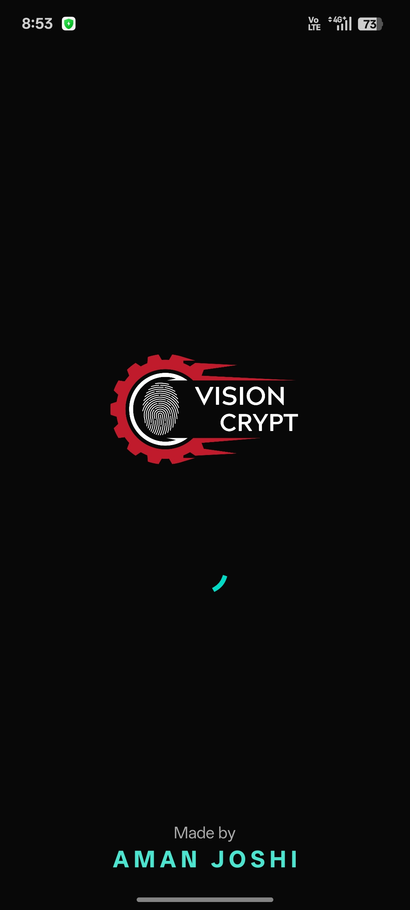
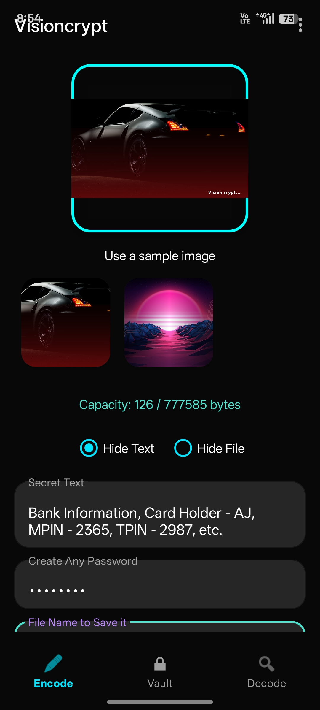
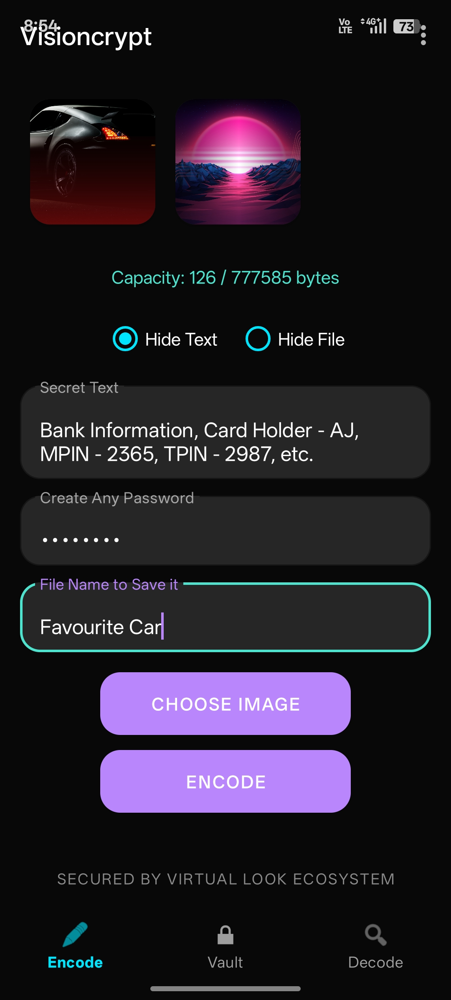
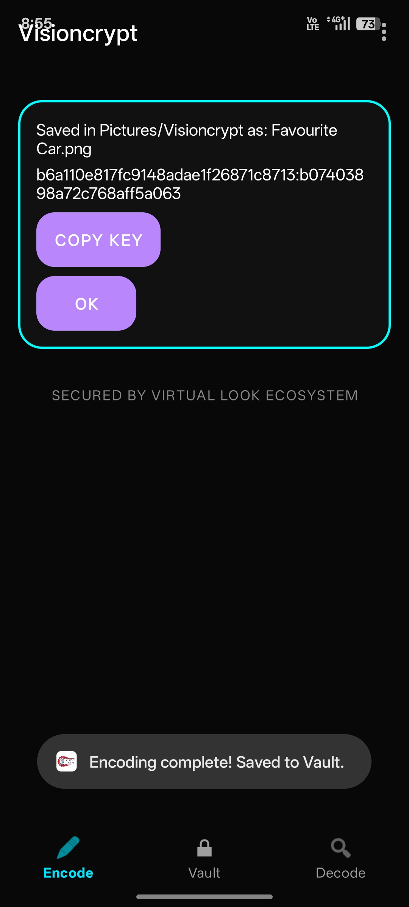
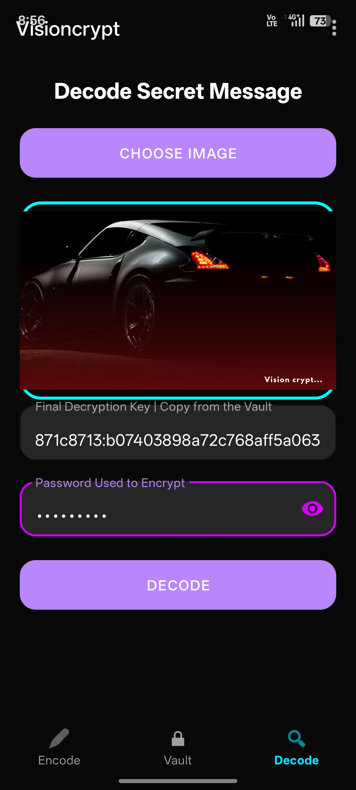
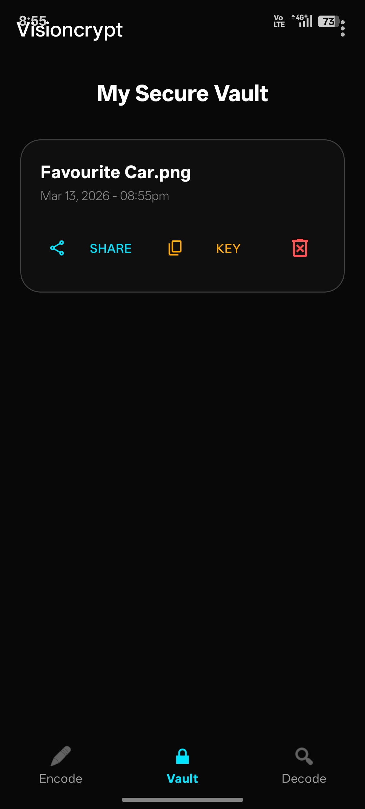

# 🛡️ VISIONCRYPT

### Advanced Steganography & Data Sovereignty Vault

Visioncrypt is an **offline-first Android steganography security vault** that hides encrypted data inside images using **LSB steganography** combined with **AES-256 encryption**.

---

### Download APK

[Download Visioncrypt](https://github.com/CodingWorld-007/Visioncrypt-Application/releases/latest)

---
## ✨ Features

- Offline-first encryption engine
- AES-256 GCM authenticated encryption
- Multi-channel RGB steganography
- Firebase authentication gateway
- Zero cloud processing
- Secure pixel-level data embedding

---

# 🔐 Security Architecture

Visioncrypt encrypts data before embedding it into the image.

User Data
↓
PBKDF2 Key Derivation
↓
AES-256 Encryption
↓
LSB Steganography
↓
PNG Carrier Image

---

# 📱 How to Use

| Introduction Screen |
|---------------|
|  |

### Encode

1. Select carrier/Sample image
2. Enter secret data
3. Enter Password, According to your preference
4. Encode It, and later export to your known.

⚠ Send image **as file/document only**

| Encode Screen |
|---------------|
|  |
|---------------|
|  |
|---------------|
|  |
---

### Decode

1. Import encoded PNG
2. Enter Encryption key from the Source.
3. Enter Password, Used to Encrypt it.
4. Decoded Message/File will pop up.

| Decode Screen |
|---------------|
|  |

### Vault

Your Saved Encyption Key, and the Details related to your Encoded Data.

| Vault Screen |
|---------------|
|  |

---

# 📥 Download

Latest APK available in the **Releases section**.

---

# 🔒 Source Code Policy

Visioncrypt is **closed-source** to prevent reverse engineering of the cryptographic architecture.

Only the application binaries and documentation are publicly distributed.

---

## Author

Aman Joshi

LinkedIn  
https://www.linkedin.com/in/amanajjoshi

---

## License

This project is licensed under the MIT License.
