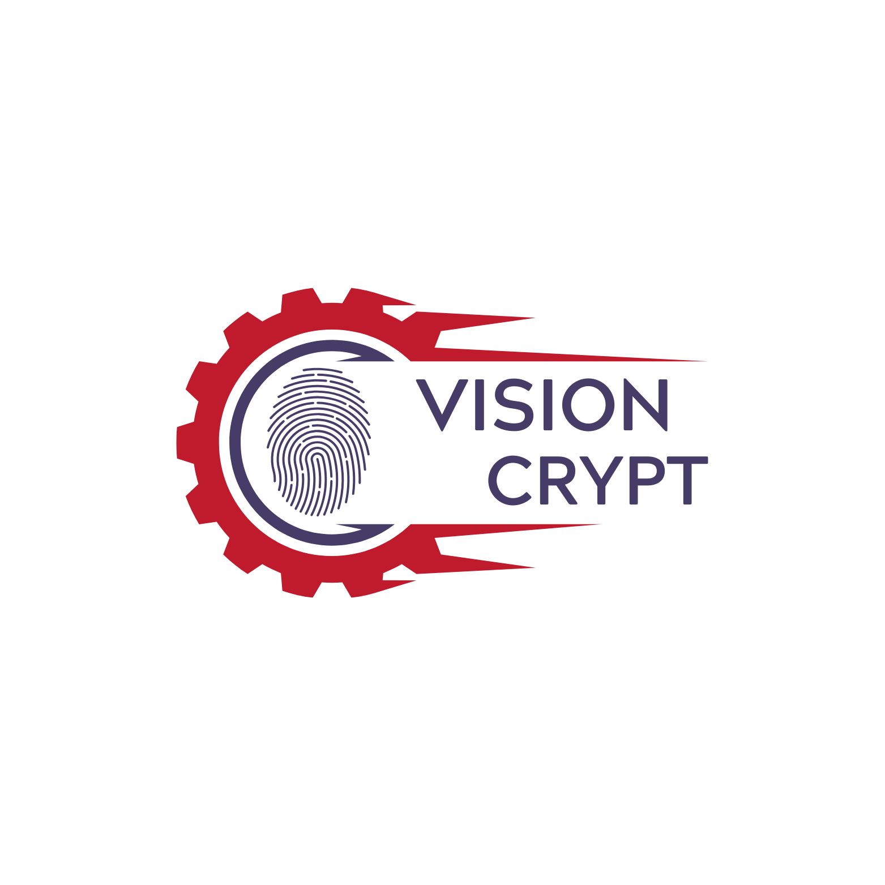

<p align="center">
  
</p>

<h1 align="center">🛡️ Visioncrypt</h1>

<p align="center">
Advanced Steganography & Data Sovereignty Vault
</p>

<p align="center">


-orange)

</p>

<p align="center">

<a href="https://github.com/CodingWorld-007/Visioncrypt-Application/releases/latest">

</a>

</p>

---

# 📥 Download

Download the latest APK from GitHub Releases.

🔗 https://github.com/CodingWorld-007/Visioncrypt-Application/releases/latest

---

# ✨ Features

• **Offline-First Encryption Engine**  
All cryptographic operations run locally on the device.

• **AES-256 GCM Encryption**  
Industry-standard authenticated encryption.

• **Multi-Channel RGB Steganography**  
Encrypted data is embedded across the Red, Green, and Blue pixel channels.

• **Firebase Authentication Gateway**  
User verification before vault access.

• **Zero Cloud Processing**  
Sensitive data never leaves the device.

• **Pixel-Level Data Embedding**  
Minimal visual distortion with maximum concealment.

---

# 🔐 Security Architecture

Visioncrypt encrypts data **before** embedding it inside an image.

```
User Data
   ↓
PBKDF2 Key Derivation
   ↓
AES-256 Encryption
   ↓
LSB Steganography
   ↓
PNG Carrier Image
```

Even if hidden data is extracted, it remains **cryptographically protected**.

---

# 📱 How to Use

## Introduction Screen

| Introduction |
|-------------|
|  |

---

# 🔏 Encode Data

1. Select a **carrier or sample image**
2. Enter your **secret message or file**
3. Enter a **password**
4. Encode the data and **export the generated PNG**

⚠ **Important**

Always send the encoded image as a **Document/File**.

Sending it as a **Photo** compresses the image and permanently destroys the hidden data.

---

| Encode Screen |
|---------------|
|  |

| Encode Options |
|---------------|
|  |

| Encryption Key |
|---------------|
|  |

---

# 🔓 Decode Data

1. Import the encoded PNG image  
2. Enter the **Encryption Key**  
3. Enter the **Password used during encoding**  
4. The hidden **message or file will be extracted**

| Decode Screen |
|---------------|
|  |

---

# 🔐 Vault

The **Vault** stores:

• Saved encryption keys  
• Metadata related to encoded images  
• User encryption history  

| Vault Screen |
|---------------|
|  |

---

# 🔒 Source Code Policy

Visioncrypt is **closed-source** to protect the cryptographic architecture and prevent reverse-engineering of the steganography engine.

Only **application binaries and documentation** are publicly distributed.

---

# 👨‍💻 Author

**Aman Joshi**

LinkedIn  
https://www.linkedin.com/in/amanajjoshi

---

# 📜 License

This project is licensed under the **MIT License**.
